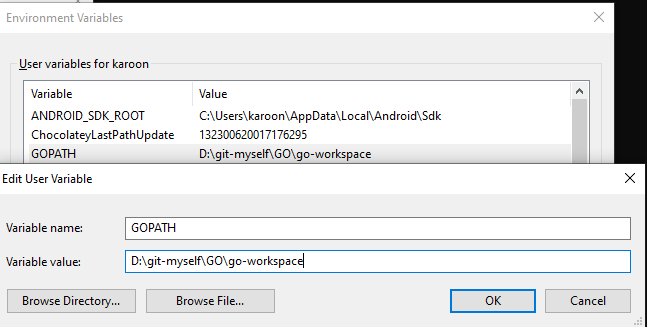

# GO go
This project use for keep example and labs

## Setup GO go
- [Downdload GO](https://golang.org/doc/install)
- Check version after install go 
```
C:\Users\updev> go version
go version go1.16 windows/amd64
```

## Setup GO work space

### windows (10)
- run ``go env`` เพื่อเป็นการตรวจสอบ go environment ของเครื่องเรา
    ```
    PS D:\git-myself\GO> go env
    set GO111MODULE=
    set GOARCH=amd64
    set GOBIN=
    set GOCACHE=C:\Users\karoon\AppData\Local\go-build
    set GOENV=C:\Users\karoon\AppData\Roaming\go\env
    set GOEXE=.exe
    set GOFLAGS=
    set GOHOSTARCH=amd64
    set GOHOSTOS=windows
    set GOMODCACHE=C:\Users\karoon\AppData\workspace\pkg\mod
    set GOPATH=C:\Users\karoon\AppData\workspace
    ```
    โดยค่าที่แสดงจะเป็นค่า Default ของแต่ละ เครื่อง
- Create my workspace สำหรับเก็บ project ของเรา
    ```
    PS D:\git-myself\GO> mkdir go-workspace
    Directory: D:\git-myself\GO
    Mode                LastWriteTime         Length Name
    ----                -------------         ------ ----
    d-----       05/03/2021     13:18                go-workspace
    ```
- ทำการ Config GOPATH ใน windows environment variable

  


## Config workspace directory

- ทำการสร้าง Directory ``go-workspace\src`` โดย go-workspace นั้นก็คือ folder ที่เราทำการสร้าง และกำหนดให้เป็น ``GOPATH`` นั้นเอง และเราก็ทำการสร้าง folder ``src`` เพื่อทำการจัดเก็บ Project ของเรา

  ```
  PS D:\git-myself\GO\go-workspace> ls
  Directory: D:\git-myself\GO\go-workspace
  Mode                LastWriteTime         Length Name
  ----                -------------         ------ ----
  d-----       06/03/2021     15:27                src
  ```

## Create mini project helloworld
เรามาเริ่มสร้าง project ง่าย อย่างเช่น helloworld ใน Deirectory ที่เราเตรียมไว้แล้ว
  ```
    D:\git-myself\GO\go-workspace\src> mkdir helloworld
    D:\git-myself\GO\go-workspace\src> cd .\helloworld\
    D:\git-myself\GO\go-workspace\src\helloworld>
  ```
ทำการสร้าง file ``main.go`` ใน directory

```
package main

func main(){
	println("Hello World")
}
```
และลองทำการ run 
```
PS D:\git-myself\GO\go-workspace\src\helloworld> go run main.go
Hello World
```
และนั้นก็คือ first program เกี่ยวกับ GO go

ต่อไปเราจะเอาขึ้น GIT กันแต่เพื่อไม่ให้ งง จะขอ Rename folder จาก ``helloworld => updev-go-helloworld`` และเราก็มา test กันหน่อยว่าสามารถใช้งานได้หรือเปล่า

```
PS D:\git-myself\GO\go-workspace\src\updev-go-helloworld> go run main.go
Hello World
```

ทำการสร้าง git และเอา code ของเรา และทำการทดสอบ

```
PS D:\git-myself\GO\go-workspace\src\updev-go-helloworld> ls

    Directory: D:\git-myself\GO\go-workspace\src\updev-go-helloworld

Mode                LastWriteTime         Length Name
----                -------------         ------ ----
-a----       06/03/2021     16:02            284 .gitignore
-a----       06/03/2021     15:51             56 main.go
-a----       06/03/2021     16:02             45 README.md

PS D:\git-myself\GO\go-workspace\src\updev-go-helloworld> go run main.go
Hello World
```

> Example Code [code : updev-go-helloworld](https://github.com/ksupdev/updev-go-helloworld)


## ปรับปรุง My go-workspace

ตอนนี้ directory ของ go-workspace 
```
PS D:\git-myself\GO\go-workspace\src> ls

    Directory: D:\git-myself\GO\go-workspace\src

Mode                LastWriteTime         Length Name
----                -------------         ------ ----
d-----       06/03/2021     16:02                updev-go-helloworld
```
ซึ่งเดียวเราจะปรับแปลี่ยนให้เหมือนกับที่ชาวบ้านทำกัน ตามที่มีการแนะนำจากทาง GitHub
```
D:\git-myself\GO\go-workspace\src\updev-go-helloworld
change to
D:\git-myself\GO\go-workspace\src\github.com\ksupdev\updev-go-helloworld
```
โดย ``github.com\ksupdev`` นั้นก็คือ github ของเรานั้นเอง 

- ทำการปรับโครสร้าง folder
  ```
  D:\git-myself\GO\go-workspace\src> mkdir github.com
  D:\git-myself\GO\go-workspace\src\github.com> mkdir ksupdev
  D:\git-myself\GO\go-workspace\src\github.com\ksupdev
  ```
- ทำการ ย้าย project ``updev-go-helloworld`` ไปไว้ที่ Directory ใหม่ที่เราสร้างขึ้น และทำการทดสอบ run อีกที
  ```
  PS D:\git-myself\GO\go-workspace\src\github.com\ksupdev\updev-go-helloworld> go run main.go
  Hello World
  ```
## Build project
```
PS D:\git-myself\GO\go-workspace\src\github.com\ksupdev\updev-go-helloworld> go build
go: cannot find main module, but found .git/config in D:\git-myself\GO\go-workspace\src\github.com\ksupdev\updev-go-helloworld
        to create a module there, run:
        go mod init
```
และ error เนื่องจากไม่ได้มีการกำหนด module ซึ่งเป็นข้อกำหนดใหม่

จาก error มีการแนะนำให้ run ``go mod init`` เพื่่อทำการ create module ใน Directory นี้

```
PS D:\git-myself\GO\go-workspace\src\github.com\ksupdev\updev-go-helloworld> go mod init
go: creating new go.mod: module github.com/ksupdev/updev-go-helloworld
go: to add module requirements and sums:
        go mod tidy
```

หลังจากดราทำการ run command เราจะพบ ``go.mod`` อยู่ใน Folder
```
// file go.mod

module github.com/ksupdev/updev-go-helloworld

go 1.16

```

ทำการ run ``go build`` อีกที และเราจะได้ `` updev-go-helloworld.exe`` อยู่ใน directory

ทำการทดสอบ program โดยการ
```
PS D:\git-myself\GO\go-workspace\src\github.com\ksupdev\updev-go-helloworld> .\updev-go-helloworld.exe
Hello World
```


## Example project
- [Hello word](updev-go-hellowold) : Hello world

